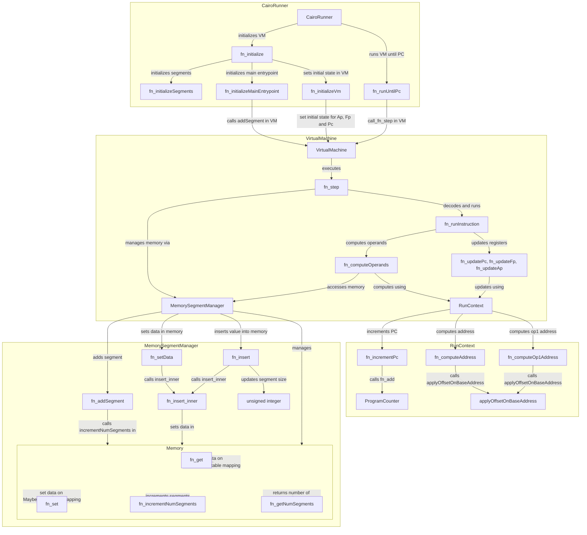
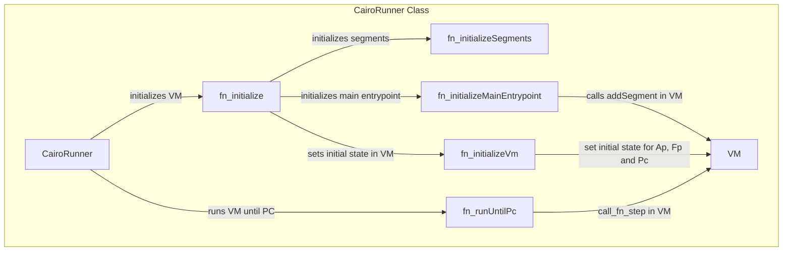
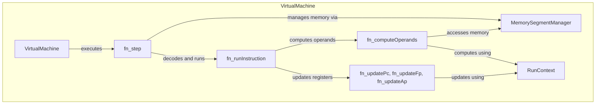
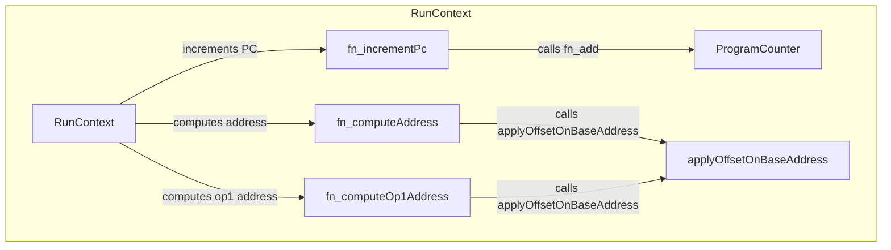
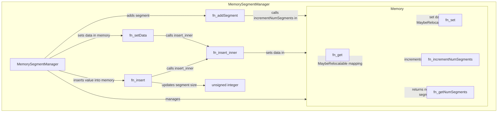

# Cairo VM in Typescript

## What is Cairo

<!-- TODO: fill this section -->

Cairo stands for CPU AIR "o" (like insp"o", conv"o", 🤔). See
[Cairo whitepaper](https://eprint.iacr.org/2021/1063) for more information.

## Why this

There are currently three Cairo VM implementations:

- the original
  [python implementation](https://github.com/starkware-libs/cairo-lang) by
  Starkware (prod)
- the new [rust implementation](https://github.com/lambdaclass/cairo-vm) by
  Lambda Class (prod)
- a new [go implementation](https://github.com/lambdaclass/cairo-vm_in_go) by
  Lambda Class (dev)

<!-- TODO: add some context about the need of client diversity -->

The Go implementation comes with an
[impressive documentation](https://github.com/lambdaclass/cairo-vm_in_go/blob/main/README.md#documentation)
regarding the how-to for a Cairo VM. This repo is coded with the flow while
reading it.

Read so far up to
[#Run Context](https://github.com/lambdaclass/cairo-vm_in_go/blob/main/README.md#runcontext)

## Requirements

- Install [bun](https://bun.sh/)
- Run `bun install` to install all dependencies
- Run `bun test` to run all tests

## Introduction to Cairo VM
Cairo VM is an advanced virtual CPU architecture designed for blockchain technology and cryptographic operations. It's Turing-complete and STARK-friendly, efficiently handling complex program statements as polynomial equations over a finite field. This feature is crucial for secure and effective cryptographic proof management in blockchain applications, making Cairo VM a key player in the realm of decentralized computing.

## Register-Based VM
Cairo VM's register-based architecture allows for quicker data access compared to stack based interaction, enhancing computational efficiency and performance in cryptographic operations.

## Detailed Architecture Overview
- **Finite Field Operations**: Core to Cairo VM's computational power for cryptographic aspects of STARKs.

- **Three-Register System**: The Cairo VM employs a three-register system, consisting of:

    - **Program Counter (PC)**: Manages the sequence of program execution by holding the memory address of the next instruction.
    - **Allocation Pointer (AP)**: Crucial for memory management, it points to the first unused memory cell, dynamically adjusting as the program runs.
    - **Frame Pointer (FP)**: Facilitates access to a function's local memory, crucial for handling function calls and maintaining the state of local variables.

## Advanced Functionality and Impact
- **Scalability and Efficiency**: Integration with STARKs for efficient verification of computational claims.
- **Security Enhancements**: Read-only memory model and finite field operations fortify Cairo VM against common vulnerabilities.
- **Flexibility and Turing Completeness**: Suitable for a variety of applications, from simple smart contracts to complex decentralized applications.

## Overall Cairo VM TS Flow

- **Overview**: The Cairo VM TS Flow diagram illustrates the interconnectivity and operational dynamics of the various classes within the Cairo VM TypeScript implementation. It showcases how each class contributes to the overall functioning of the VM, detailing the interactions between the VirtualMachine, RunContext, MemorySegmentManager, Memory, and CairoRunner classes. This flowchart is a tool for understanding the architecture and inner workings of the Cairo VM, highlighting the orchestration of instruction execution, memory management, and execution control within this sophisticated virtual environment.

## CairoRunner Class (CairoRunnerClass)

- **Overview**: CairoRunner is pivotal in the initial setup and execution flow of the Cairo VM in the TypeScript environment. It meticulously handles the initialization of memory segments, setting up the main entry point, and defining the initial state of the VM, laying down the foundational elements necessary for program execution.

- **Main Functions**:
    - `initialize`: Sets up the Cairo VM by initializing the necessary segments and the main entry point. This function lays the groundwork for the VM's operational environment.

    - `runUntilPc`: Controls the execution of the VM until a specified program counter (PC) is reached. It repeatedly invokes the VM's step function, progressing through the program instructions until the end condition is met.

    - `initializeSegments`: Responsible for creating the program and execution segments in the VM's memory. This function allocates the necessary memory space for the program's execution, setting the stage for the instructions to be loaded and executed.

    - `initializeMainEntrypoint`: Initializes the main function entry point of the program. This includes setting up the initial registers and determining the final PC for the main function.

    - `initializeFunctionEntrypoint`: Sets up a function entry point in the VM. This involves preparing the registers for the function call and calculating the final PC for the function.

    - `initializeState`: Configures the initial state of the VM, including setting the initial PC, AP, and FP, and loading the program data into the VM's memory.

    - `initializeVm`: Finalizes the VM's initialization by setting the run context's AP, FP, and PC to their initial values, ensuring the VM is ready to execute the program.

## VirtualMachine Class (VirtualMachineClass)

- **Overview**: At the heart of Cairo VM's TS implementation lies the VirtualMachineClass, a complex and sophisticated engine driving the core functionalities of the VM. This class is intricately involved in the processing of each instruction, from decoding the bytecode to executing the corresponding operations. It adeptly manages the interplay between memory, computation, and state transitions.

- **Functions**:
    - `fn_step`: This function acts as the heartbeat of the VirtualMachine, propelling the execution process forward. It retrieves the next encoded instruction from memory, decodes it, and then proceeds to run the instruction. The function embodies the cycle of fetch-decode-execute, pivotal in the VM's operation, and ensures that the VM advances through the program correctly.

    - `fn_runInstruction`: Central to the VM's instruction processing, this function takes a decoded instruction and orchestrates its execution. It computes the operands, performs any necessary assertions (especially for assert and call opcodes), updates the VM's registers, and progresses the VM's step count. This function is where the VM's instruction logic comes to life, translating the decoded instructions into concrete actions.

    - `fn_computeOperands`: As the VM's computational strategist, this function computes the operands required for the current instruction. It handles the intricacies of fetching operand values from memory or deducing them based on the instruction's context. This includes computing addresses for operands, handling special cases for undefined operands, and ensuring all operands are ready for the execution phase.

    - `fn_updatePc, fn_updateFp, fn_updateAp`: These functions collectively maintain the VM's register state, ensuring that the program counter (PC), frame pointer (FP), and allocation pointer (AP) are updated in accordance with the executed instruction. They handle various scenarios, such as regular PC increments, jumps, conditional jumps, and updates to the FP and AP based on the instruction's logic. These updates are critical for the correct flow of program execution and memory management within the VM.
## RunContext Class (RunContextClass)

- **Overview**: The RunContext Class functions as the navigator of the Cairo VM, maintaining crucial pointers and counters that guide the execution process. It ensures that the VM's state is consistently aligned with the program's progression, effectively managing the transition between different states and instructions. This class is responsible for the accurate tracking of execution flow, making it pivotal for the orderly and precise operation of the VM.
- **Functions**:
    - `incrementPc`: Advances the program counter by the size of the current instruction, effectively moving the execution to the next instruction in the program.

    - `computeAddress`: Calculates the address of a memory location based on a given register (AP or FP) and an offset. This function is crucial for determining the correct memory addresses for operand access during instruction execution.

    - `computeOp1Address`: Determines the address of the second operand (operand 1) based on the source register, an offset, and the value of the first operand (operand 0). This function is essential for fetching the second operand's value, especially when it is dynamic or dependent on other operands.

## MemorySegmentManager Class / Memory 

- **Overview (MemorySegmentManager)**: The MemorySegmentManager Class acts as the memory architect of the Cairo VM, expertly managing the allocation and organization of memory segments. It ensures that memory is efficiently utilized, providing a structured and secure space for program data and operational needs. This class plays a critical role in maintaining the integrity and accessibility of the VM's memory, which is crucial for the seamless execution of Cairo programs.
- **Functions (MemorySegmentManager)**:
    - `addSegment`: This function creates a new memory segment in the VM's memory space. It generates a Relocatable pointer for the new segment and increments the total number of segments in the memory. This is essential for expanding the VM's memory capacity to accommodate new data or instructions.

    - `setData`: Responsible for writing an array of data into memory at a specified address. This function iterates through the data array, inserting each element into memory at the correct address. It also updates the size of the memory segment to reflect the newly added data, ensuring accurate memory management.

    - `insert`: Inserts a single value into memory at a given address and updates the size of the relevant memory segment. This function is crucial for adding individual pieces of data to the memory, ensuring that each insertion is accurately tracked and stored.

    - `insert_inner`: A private helper function that performs the actual insertion of a value into memory. It checks for existing data at the specified address and throws an error if an attempt is made to overwrite it, adhering to the write-once policy of memory segments.

    - `getSegmentSize`: Returns the current size of a specified memory segment. This function is key to understanding the memory usage and allocation within a particular segment, providing insights into the memory layout of the VM.
    
- **Functions (Memory)**:
    - `get`: Retrieves the data stored at a specific memory address. This function forms the backbone of memory access within the VM, allowing for the retrieval of data necessary for program execution.

    - `incrementNumSegments` Increases the count of memory segments by one. This function is essential for managing the overall structure and capacity of the VM's memory, ensuring that new segments can be added as needed.

    - `getNumSegments`: Returns the current total number of memory segments. This function provides a snapshot of the VM's memory structure, giving insights into the memory resources available for program execution.

---